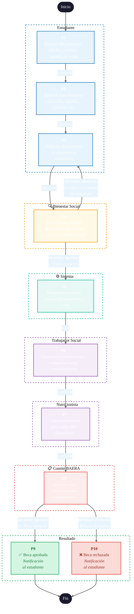

```mermaid
%%{init: {'theme': 'base', 'themeVariables': {
  'primaryColor': '#1a1a2e',
  'primaryTextColor': '#fff',
  'primaryBorderColor': '#1a1a2e',
  'lineColor': '#666',
  'secondaryColor': '#e8f4fd',
  'tertiaryColor': '#f0f2f5',
  'fontFamily': 'Arial, sans-serif'
}}}%%

flowchart TD
    INICIO([Inicio]) --> P1

    subgraph Estudiante["👤 Estudiante"]
        direction TB
        P1["<b>P1</b><br>Registro del postulante<br><i>CI, RU, nombres,<br>carrera, facultad</i>"]
        P2["<b>P2</b><br>Datos socioeconómicos<br><i>dirección, ingresos,<br>vivienda, etc.</i>"]
        P3["<b>P3</b><br>Adjuntar documentos<br><i>11 documentos<br>requeridos</i>"]
    end

    subgraph Bienestar["🔍 Bienestar Social"]
        P4["<b>P4</b><br>Revisión documental<br><i>checklist por documento<br>✅ Correcto / ❌ Observado</i>"]
    end

    subgraph Auto["⚙️ Sistema"]
        P5["<b>P5</b><br>Programar entrevista<br><i>asignación automática<br>+1 día</i>"]
    end

    subgraph Trabajo["🤝 Trabajador Social"]
        P6["<b>P6</b><br>Entrevista socioeconómica<br><i>evaluación social<br>y recomendación</i>"]
    end

    subgraph Nutricion["🥗 Nutricionista"]
        P7["<b>P7</b><br>Control nutricional<br><i>peso, talla, IMC,<br>diagnóstico</i>"]
    end

    subgraph Comite["📋 Comité BAERA"]
        P8["<b>P8</b><br>Decisión final<br><i>revisa informes<br>consolidados</i>"]
    end

    subgraph Final["🏁 Resultado"]
        P9["<b>P9</b><br>✅ Beca aprobada<br><i>Notificación<br>al estudiante</i>"]
        P10["<b>P10</b><br>❌ Beca rechazada<br><i>Notificación<br>al estudiante</i>"]
    end

    P1 -->|siguiente| P2
    P2 -->|siguiente| P3
    P3 -->|siguiente| P4

    P4 -->|"<b>decisión: aprobar</b><br>✅ Todos correctos"| P5
    P4 -->|"<b>decisión: observar</b><br>⚠️ Algún documento<br>fue observado"| P3

    P5 -->|auto| P6
    P6 -->|siguiente| P7
    P7 -->|siguiente| P8

    P8 -->|"<b>decisión: aprobar</b><br>✅ Beca otorgada"| P9
    P8 -->|"<b>decisión: rechazar</b><br>❌ Beca denegada"| P10

    P9 --> FIN([Fin])
    P10 --> FIN

    style INICIO fill:#1a1a2e,color:#fff,stroke:#1a1a2e,stroke-width:2px
    style FIN fill:#1a1a2e,color:#fff,stroke:#1a1a2e,stroke-width:2px
    style P1 fill:#e8f4fd,stroke:#2980b9,stroke-width:2px
    style P2 fill:#e8f4fd,stroke:#2980b9,stroke-width:2px
    style P3 fill:#e8f4fd,stroke:#2980b9,stroke-width:2px
    style P4 fill:#fef9e7,stroke:#f39c12,stroke-width:2px
    style P5 fill:#e8f8f5,stroke:#1abc9c,stroke-width:2px
    style P6 fill:#f5eef8,stroke:#9b59b6,stroke-width:2px
    style P7 fill:#f5eef8,stroke:#9b59b6,stroke-width:2px
    style P8 fill:#fdedec,stroke:#e74c3c,stroke-width:2px
    style P9 fill:#d5f5e3,stroke:#27ae60,stroke-width:2px,color:#1a7a3a
    style P10 fill:#fadbd8,stroke:#e74c3c,stroke-width:2px,color:#922b21
    style Estudiante fill:none,stroke:#2980b9,stroke-width:2px,stroke-dasharray: 5 5
    style Bienestar fill:none,stroke:#f39c12,stroke-width:2px,stroke-dasharray: 5 5
    style Auto fill:none,stroke:#1abc9c,stroke-width:2px,stroke-dasharray: 5 5
    style Trabajo fill:none,stroke:#9b59b6,stroke-width:2px,stroke-dasharray: 5 5
    style Nutricion fill:none,stroke:#9b59b6,stroke-width:2px,stroke-dasharray: 5 5
    style Comite fill:none,stroke:#e74c3c,stroke-width:2px,stroke-dasharray: 5 5
    style Final fill:none,stroke:#27ae60,stroke-width:2px,stroke-dasharray: 5 5
    linkStyle default stroke:#666,stroke-width:2px
```
